# Procesverslag

### Ontwerper:
Michael Wilhelm

#### Je startniveau:
Mijn startniveau is: blauw

# Je plan

  
De eerste versie/schets van mijn ontwerp & persoonlijke uitdaging

  ### De eerste versie/schets:
  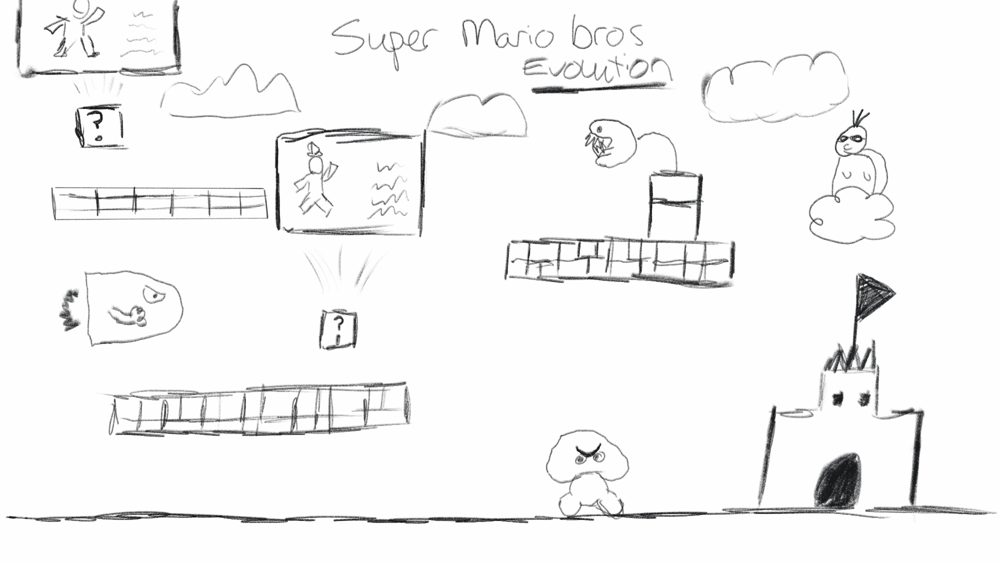
  Wanneer Mario tegen een blokje springt met een vraagteken erop (of wanneer je met de muis klikt) komt er een overlay waar ik per mario bros game het karakter toon en informatie geef. Elk blokje met vraagteken toont een ander overlay met informatie over het Mario character uit die game. De blokjes die over de wereld zijn verspreid nemen ook het uiterlijk van de game waar informatie over komt. 

  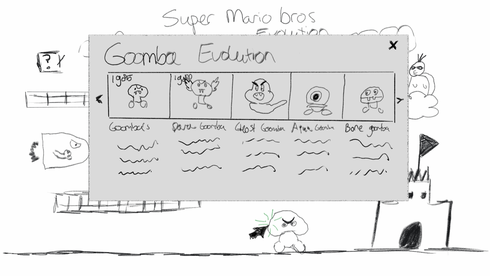
  Wanneer je tegen een vijand aanloopt (of op klikt) komt de evolutie van de vijand in beeld te zien. Sommige vijanden hebben door de jaren heen grote veranderingen of andere eigenschappen gekregen in een game, dit ga ik tonen met jaartal, in welke game het zit en een kleine uitleg over het karakter. 

  ### Je ambitie: 
  Aan deze technieken/punten wil ik werken:
  - Een mariokarakter laten lopen door mijn site (mocht dit teveel werk zijn maak ik het klikbaar)
  - De website schaalbaar maken, ik wil geen statische site. 
  - Werken aan mijn Javascript, ik ben hier niet zo goed in.
  - Beter leren positioneren met CSS.
 

## Voortgang/Feedback 1

  
Mijn bevindingen + wijzigingen (minimaal 5)

  ### Bevinding 1:
  Het idee was om verschillende vijanden van Mario neer te zetten, en wanneer je daarop kon klikken de verschillende generaties toe te voegen. Ik kreeg van veel mensen te horen dat het te veel werk zou zijn.

  #### oplossing:
  Ik ben verder gegaan op het idee om alleen de timeline van de Goomba te laten zien.

  ### Bevinding 2:
  Ik had verschillende generaties nodig voor de goombas, het idee was om ze heen en weer te laten lopen op het scherm. Hiervoor heb ik gifjes gebruikt, alleen was er niet van elke generatie Goomba een knap gifje te vinden. 

  #### oplossing:
  Ik ben zelf die gifjes gaan vergroten, en meer kwaliteit gegeven. Hier ben ik best veel uur aan kwijtgeraakt.
  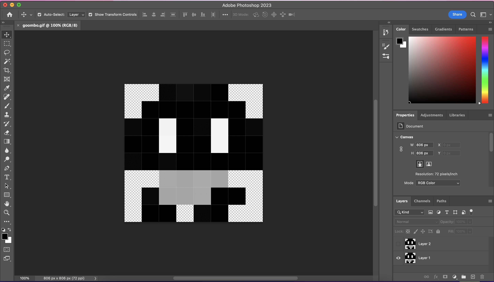

  ### Bevinding 3:
  Na het maken van de gifs ben ik bezig geweest om de goomba's te laten lopen. Dit deed ik doormiddel van Keyframes.
  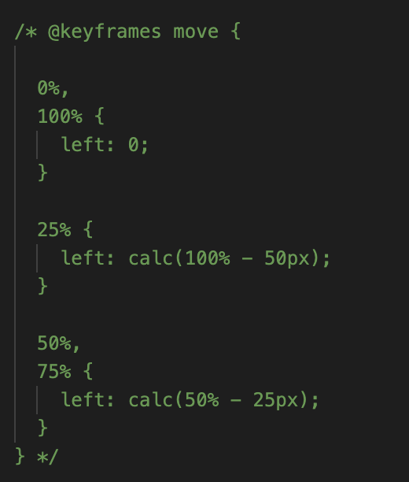
  Hierdoor kreeg ik alleen niet het gewenste effect, ik wil de goomba niet elke keer dezelfde beweging laten maken want dit wordt snel erg saai.

  #### oplossing:
  Ik heb een opzet gemaakt om een blokje te laten bewegen met Javascript, het eerste opzet had chatGPT gegenereerd, hier kwam al een goede basis uit die ik zelf heb bewerkt met hulp van stackoverflow.
  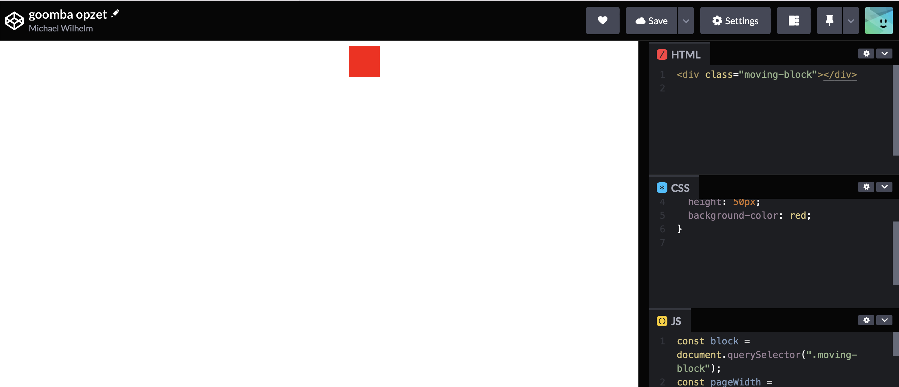

  ### Bevinding 4:
  Na het maken van alle gifs en de goomba te laten lopen kwam ik op een probleem. Ik had meerdere gifs die ik wou laten lopen, alleen liep de eerste goomba nu maar de voor de andere goombas werkte de functie niet.

  #### oplossing:
  Door de code van Sanne op codepen te bekijken (als tip van Sanne) heb ik de functie aangepast door ForEach te gebruiken.
  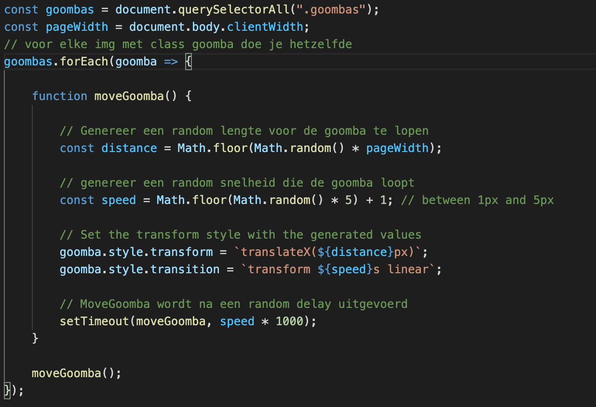

  ### Bevinding 5:
  Ik wou alvast meer beginnen met het denken over een algemene stijl. 

  #### oplossing:
  Ik heb een goede font gevonden genaamd Super Plumber Brothers.

## Voortgang/Feedback 2

  
Mijn bevindingen + wijzigingen (minimaal 5)

  
  ### Bevinding 1:
  Om de goombas 1 voor 1 te tonen heb ik een functie gemaakt waardoor de eerste goomba op show staat en wanneer je daarop klikt de 2e goomba show krijgt en hide verwijdert en de goomba waarop wordt geklikt hide wordt gezet. Eerst had ik onclick events in HTML gebruikt.
  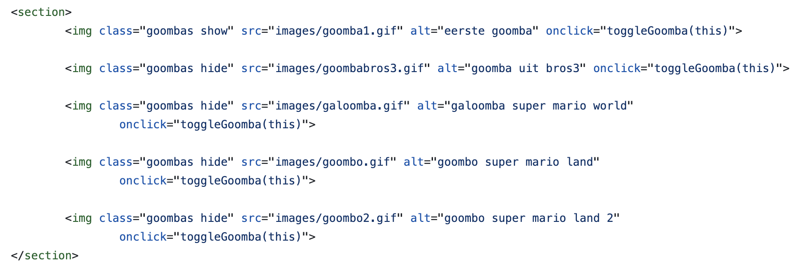
  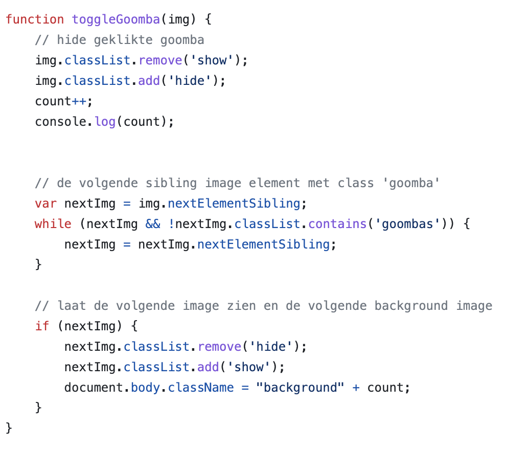

  #### oplossing:
  Ik kwam erachter dat dit niet de bedoeling is, dus ben ik eventlisteners gaan gebruiken.

  ### Bevinding 2:
  Toen de goombas konden lopen en klikbaar waren waardoor de volgende generatie naar voren kwam ben ik gaan kijken of ik een level kon maken als achtergrond, toen ik de wolken had geplaatst en geanimeerd kwam ik erachter dat het erg veel werk was om een level te maken en ik wou voor elke goomba een level uit hun generatie.

  #### oplossing:
  Ik heb van de generaties die ik heb gebruikt het eerste level uit de game waar ze in voor kwamen gevonden als sprite, hier heb ik met keyframes ervoor gezorgd dat je links in het level begint en uiteindelijk rechts komt. 

  ### Bevinding 3:
  Nu ik alle backgrounds had moest ik ervoor zorgen dat de achtergrond mee veranderde wanneer er op een goomba wordt geklikt. Hier heeft Alex meegeholpen want hij heeft een soortgelijke functie gebruikt.

  #### oplossing:
  Door op de body een class background te zetten en de functie togglegoomba zo aan te passen dat er werd geteld op welk count ik zat kon ik voor background1 t/m 5 de background image veranderen.
  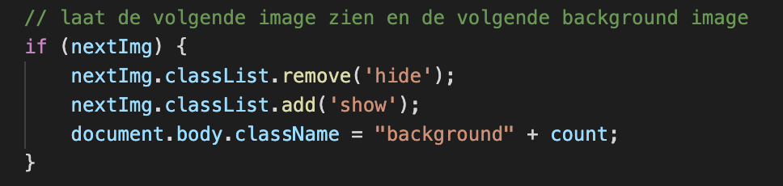

  ### Bevinding 4:
  Nu werd de achtergrond en de goomba verandert wanneer je op een goomba drukt. Nu wou ik ook dat de informatie die ik toon wordt aangepast wanneer je op een goomba drukt.
  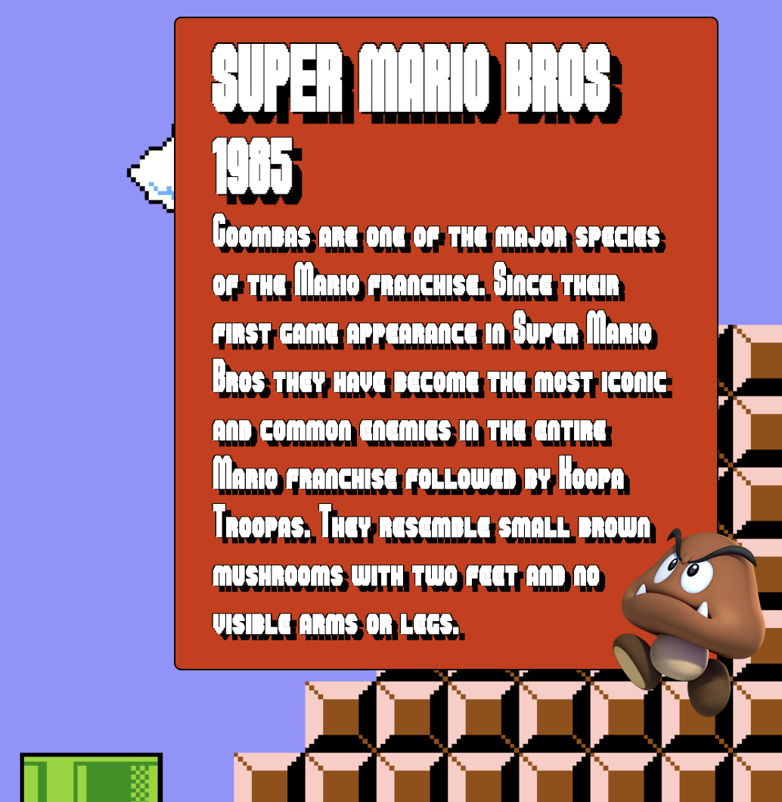

  #### oplossing:
  Door een combinatie van de Javascript code van nextImg en de count voor de background image.
  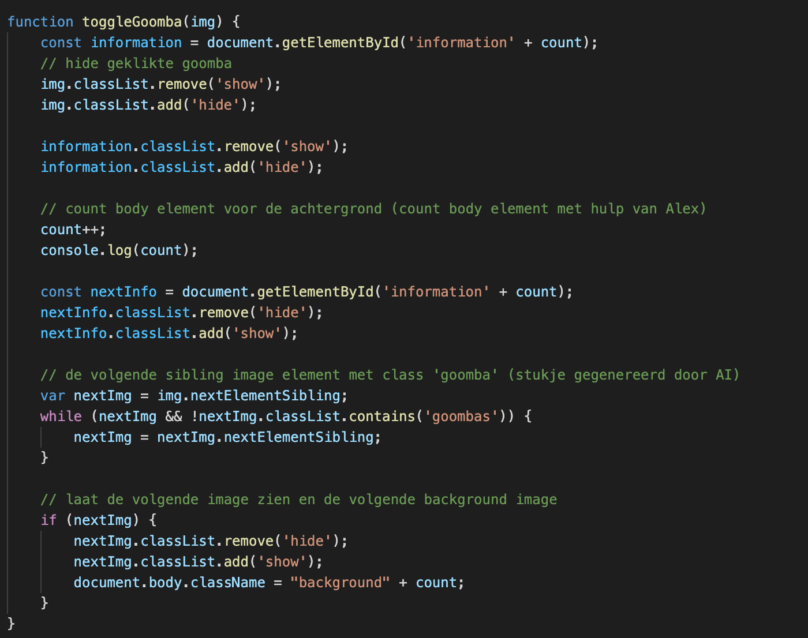

  ### Bevinding 5:
  De achtergrond voor de laatste generatie in mijn ontwerp knipperde of ging weg wanneer het op een bepaald punt kwam.

  #### oplossing:
  Na veel kijken in mijn code bleek het aan de afbeelding zelf te liggen, ik moest de hoogte op 1080px zetten en nu ging er niks mis.

## Voortgang/Feedback 3

  
Mijn bevindingen + wijzigingen (minimaal 5)

  
  ### Bevinding 1:
  Het was nog niet duidelijk genoeg dat je op de goombas moet klikken om zo door de tijdlijn te gaan.

  #### oplossing:
  Ik heb de cursor aangepast naar mario en wanneer je over een goomba hovert verandert mario van positie, hierdoor lijkt het alsof je op de goomba moet springen zodat je weet dat je moet drukken. Ook heb ik voor de zekerheid nog gezorgt voor een How to play button.

  ### Bevinding 2:
  De cursor die ik toe had gevoegd verdween soms van de pagina.

  #### oplossing:
  Ik heb de images verandert naar 16x16px, hierdoor verdween de cursor niet meer.

  ### Bevinding 3:
  De Goomba was klikbaar, alleen nog niet met keyboard. 

  #### oplossing:
  Ik heb een tabindex en focus state op de goomba gezet zodat wanneer je tab gebruikt ook over de goomba heen komt. Ik heb een functie in Javascript toegevoegd die ervoor zorgt dat wanneer je op enter of spatie drukt op de gefocusde element je erop klikt.
  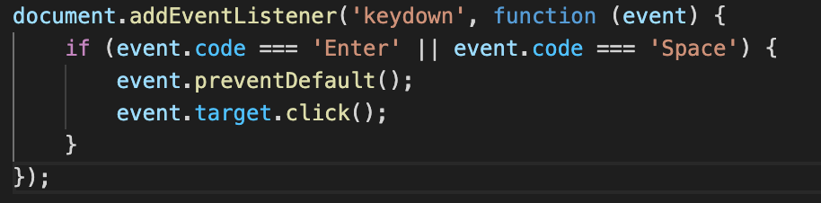

  ### Bevinding 4:
  Ik kreeg te horen dat de CSS code nog niet gestructureerd over kwam.

  #### oplossing:
  Ik heb de volgorde aangepast in me code: Position, Grootte, Margin, Padding, Kleur, Border, Cursor voor elk element.

  ### Bevinding 5:
  Ik miste nog iets voor mijn gevoel, toen kreeg ik als feedback om audio toe te voegen.

  #### oplossing:
  Ik heb de themesong van de eerste Super Mario Bros gebruikt. Je kan de song aan en uit doen wanneer je zelf wilt.

## Reflectie

  
Mijn eindresultaat & persoonlijke ontwikkeling

  ### Je uitkomst - karakteristiek screenshot(s):
  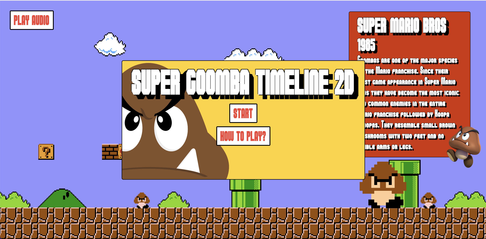

  ### Dit ging goed/Heb ik geleerd: 
  Waar ik erg trots op ben is de javascript achter het ontwerp voornamelijk dat alles op de site
  mee verandert wanneer je op een goomba drukt.

  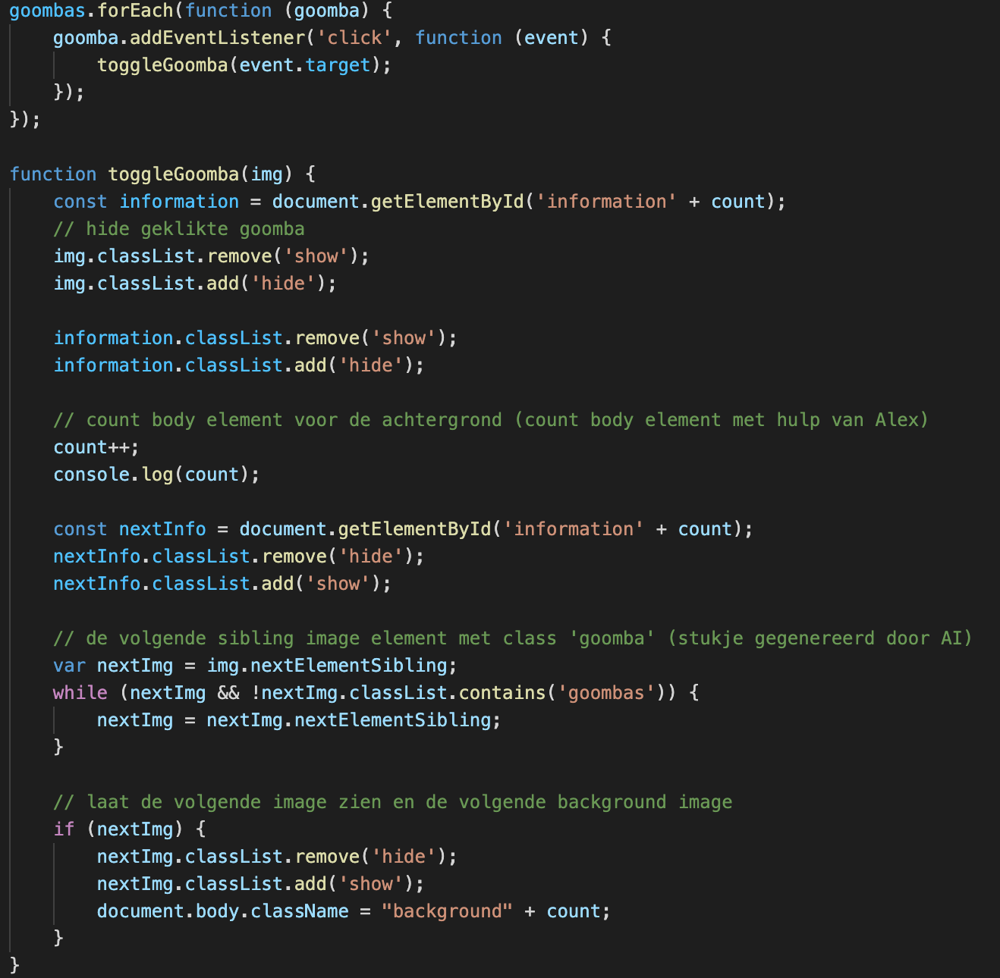

  Dit ging goed:
  - De site is redelijk schaalbaar geworden door het werken met vw en vh.
  - Javascript code schrijven, het was lastig maar wel gelukt.

  ### Dit was lastig/Is niet gelukt:
  Het was erg lastig om erachter te komen hoe ik de goomba heen en weer kon laten bewegen 
  zonder dat hij telkens dezelfde beweging maakte. Ik wou dit graag zodat er meer leven in de 
  goomba zit.

  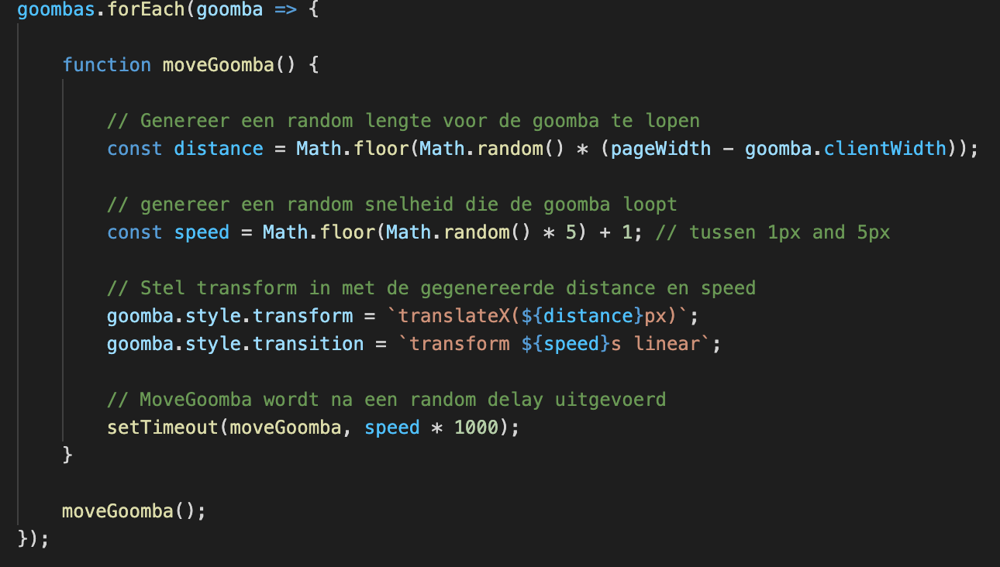

## Bronnenlijst

continu bijhouden terwijl je werkt

1. ChatGPT - voor stukje in de functie om volgende goomba in de rij te zien te krijgen.
2. https://stackoverflow.com/questions/59054548/js-get-the-clicked-element-with-event-target
3. https://www.freecodecamp.org/news/refresh-the-page-in-javascript-js-reload-window-tutorial/#:~:text=You%20can%20use%20the%20location,method%20responsible%20for%20page%20reloading
4. https://dev.to/shantanu_jana/how-to-play-sound-on-button-click-in-javascript-3m48
5. https://stackoverflow.com/questions/21944523/random-movement-in-html5-and-javascript
6. Alex (hulp bij background image veranderen)
7. Stukje code ForEach uit Sanne zijn codepen.

